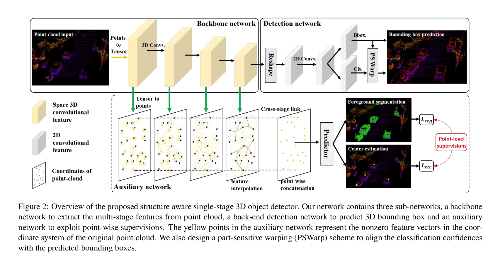

# 3D points detection and segmentation

## VoxelNet. (CVPR2018)

VoxelNet: End-to-End Learning for Point Cloud Based 3D Object Detection.

一个单阶段端到段的3D目标检测框架，主要流程是将3D点云划分成了一个个的voxel并使用pointnet++提取特征，再用3D Convolution作为backbone，
最后用RPN（Region Proposal Network）得到检测框。

该文章是较早期的使用深度学习框架对3D点云做端到端目标检测的网络，较早的引入了voxel的概念，并使用了3D卷积（内存开销大）。

### 1. 网络结构

输入为3D点云文件，4维，包括xyz和reflection。

网络整体结构如下，主要包括Feature Learning Network、Convolutional Middle Layers和最后的Region Proposal Network三个部分。

其中Feature Learning Network包括
Voxel
Partition、Grouping、Random
Sampling和Stacked Voxel
Feature Encoding
几个部分。

#### 1） Voxel Partition

**Voxel Partition** 主要就是将3D空间上的无序无组织的点云划分成一个个的voxel，
根据提前确定需要检测的3D空间范围D，H，W（超过该范围就不考虑，分别沿着Z，Y，X）和voxel的大小$v_d,v_h,v_w$可以得到最终的3D voxel grid的大小
$D' = D/v_d, H' = H / v_h, W' = W/v_w$。

文中的范围为[−3, 1] × [−40, 40] × [0, 70.4]，voxel size分别为0.4,  0.2,  0.2，
得到的3D voxel grid大小为D′ = 10, H ′ = 400, W ′ = 352。

#### 2）Grouping

**Grouping** 意思就是计算每个点云在哪个voxel中

#### 3）Random Sampling

**Random Sampling** 由于不同型号的深度传感器产生的点云数量不同，
一般总数可能在10万左右，点云的分布非常稀疏且不均匀，所以这一步主要是对每个voxel采样特定数量T的点云，
可以1）节省计算量，2）平衡每个voxel的点云数量。文中T=35

#### 4）Stacked Voxel Feature Encoding

**Stacked Voxel Feature Encoding** 根据前两步grouping和sampling的点云计算出特征。具体步骤如下：

1. 首先根据每个voxel中采样后的点云计算出局部均值（local mean），表示为$(v_x,v_y,v_z)$，
然后再用这个local mean去扩充每个点的特征，用每个点的坐标减去local mean，扩充后每个点的特征为
$\hat{\mathbf{p}}_i = [x_i, y_i, z_i, r_i, x_i - v_x, y_i - v_y, z_i - v_z] \in \mathbb{R}^7$，$i \in 1...t, t \leq T$，

2. 然后用全连接网络FCN(fully connected network)将其映射为高维特征$f_i \in \mathbb{R}^m$，FCN由线性层，BN层和ReLU层构成。FCN的参数所有点共享。

3. 其次对同一个voxel中的所有点云特征进行MaxPooling（在每个元素上），得到locally
aggregated feature $\tilde{f} \in \mathbb{R}^m$

4. 最后concat每个点的特征和aggregated feature，得到$f_i^{out} = [f_i, \tilde{f}]^T \in \mathbb{R}^{2m}$，输出的voxel中的特征集为
$\mathbf{V}_{out} = \{{f_i^{out}}\}_{i\dots t}$。

VFE-i$(c_{in} , c_{out})$表示第i个VFE layer将输入特征维转换为输出特征维，其中linear的参数量为
$c_{in} \times (c_{out} / 2)$，因为最后需要concat原始点云，所以只有一半。
VFE-1(7, 32) and VFE-2(32, 128)，最终输出128维的concat后的特征

输出concat后的特征综合了点和voxel的局部特征，可以较好的学习到物体的形状信息。
（Because the output feature combines both point-wise
features and locally aggregated feature, stacking VFE lay-
ers encodes point interactions within a voxel and enables
the final feature representation to learn descriptive shape
information.）

#### 5）Sparse Tensor Representation

**Sparse Tensor Representation** 输出的特征图维度是$C \times D' \times H' \times W'$，
一个4D tensor，大部分voxels都为空，作者将每个非空voxel和其所在的空间特征维度的坐标对应起来，
节省内存占用。文中的大小为128 × 10 × 400 × 352

#### 6）Convolutional Middle Layers

**Convolutional Middle Layers** 3D卷积提取特征。
文中使用的3D卷积为$ConvMD(c_{in} , c_{out} , k, s, p)$， M表示卷积类型，2维3维，ksp分别表示kernel size，
stride和padding。

文中使用了3个3D卷积，分别为Conv3D(128, 64, 3,
(2,1,1), (1,1,1)), Conv3D(64, 64, 3, (1,1,1), (0,1,1))，Conv3D(64, 64, 3, (2,1,1), (1,1,1))。
得到的特征图为64 × 2 × 400 × 352，再reshape得到128 × 400 × 352，分别表示channel, height, and width。

#### 7）Region Proposal Network

输入是上一模块卷积层的输出128 × 400 × 352,经过三个Conv2D blocks,
每次经过一个block宽高减半, 再用DeConv2D上采样到特定尺寸,最后进行合并,
再用两个1*1的卷积核对特征维进行降维,得到score map和regression map,
具体可参考下图.

### 2. Loss

RPN输出的regression map需要预测的targets为真值和positive anchors之间的差值,
若$\{a_i^{pos}\}_{i=1...N_{pos}}$为$N_{pos}$个positive anchors,
假设gt bbox为$(x_c^g, y_c^g,z_c^g,l^g,w^g,h^g,\theta^g)$,
分别为bbox的中心点,长宽高和yaw around Z-axis. 生成的positive anchor的
为$(x_c^a, y_c^a,z_c^a,l^a,w^a,h^a,\theta^a)$,
而我们需要预测的residual vector $\mathbf{u}^* \in \mathbb{R}^7$,定义为:

$$
\Delta x = \frac{x_c^g - x_c^a}{d_a},
\Delta y = \frac{y_c^g - y_c^a}{d_a},
\Delta z = \frac{z_c^g - z_c^a}{d_a}

$$

$$
\Delta l = log(\frac{l_g}{l^a}),
\Delta w = log(\frac{w_g}{w^a}),
\Delta h = log(\frac{h_g}{h^a})
$$

$$
\Delta \theta = \theta^g - \theta^a
$$

其中$d^a = \sqrt{(l^a)^2 + (w^a)^2}$,即anchor box BEV下对角线的长度.

总体的Loss计算如下:

$$

L = \alpha \frac{1}{N_{\text{pos}}} \sum_i L_{\text{cls}}(p_i^{\text{pos}}, 1) + \beta \frac{1}{N_{\text{neg}}} \sum_j L_{\text{cls}}(p_j^{\text{neg}}, 0) 
+ \frac{1}{N_{\text{pos}}} \sum_i L_{\text{reg}}(u_i, u_i^*)

$$

主要包括有无目标的类别损失和回归损失两块. 
其中$p_i^{\text{pos}}$和$p_j^{\text{neg}}$分别表示positive anchor和
negative anchor 的softmax输出, 最后的回归损失为真实差值和预测的差值间的损失.
$\alpha, \beta$为损失平衡系数. 文中分别使用了1.5和1 
 类别损失使用BCE, 回归使用Smooth L1损失.

文中的car detection的anchor尺寸只有一种, lwh分别为3.9, 1.6和1.56, 
中心点为Z axis-1m处, 有0度和90度两个不同的角度.

行人的数据分别为: 0.8, 0.6, 1.73, -0.6.

自行车分别为:1.76, 0.6, 1.73, -0.6

anchor为positive当这个anchor与gt bbox的IoU大于0.6或者
他比其他所有的anchor与这个gt的IoU都大; 
anchor为positive的情况这个anchor与所有的gt的IoU都小于0.4,
其他在此之间的就都忽略.

行人和自行车的IoU界限均为0.5和0.35.

### 3. 高效实现

TODO: 文中介绍了在点云较为稀疏下的网络结构实现细节.

### 4. 数据增强

#### (1) 随机扰动一个bbox中的点云

比如对一个目标框内的所有点云的围绕这中心点旋转一个特定的角度
$\Delta \theta \in [-\pi/10, pi/10]$,通过均匀采样得到,
然后再加上一个偏移(高斯分布0均值,1标准差).

并且在增强过程中会进行碰撞检测,一旦有冲突就不进行增强.

#### (2) bbox尺度变换

bbox的三维和其中的点云坐标都乘以一个特定的尺度,在[0.95, 1.05]间,均匀分布.

#### (3) 所有bboxes相对全局进行旋转

相对全局的原点沿着Z axis进行旋转. $[-\pi/4, pi/4]$间.

### 实验结果

## PointPillars (CVPR2019)

PointPillars: Fast Encoders for Object Detection from Point Clouds

PointPillars主要是将点云划分成了一个个的pillars而非voxel进行处理,
后续用2D Conv进行处理,最后RPN得到结果. PP使用2D Conv而非3D,
从而节省了大量的计算资源,因此推理速度较快.

### 1. 网络结构

#### (1) Pillar Feature Net (Pointcloud to Pseudo-Image)

将完整的点云划分成一块块的pillar(文中为0.4m * 0.4m), 
然后根据划分出的pillars计算出每个pillar中点的特征,
包括$[x, y, z, r, x_c, y_c, z_c, x_p, y_p]$,
$x_c, y_c, z_c$表示该点到这个pillar的中心点(arithmetic mean)的距离,
$x_p, y_p$为到xy BEV平面的偏移值.

记所有的非空pillar数量为P, pillar中points数量为N. 如果多了就随机采样,
少了就zero padding.

划分后的Dense Tensor为(D, P, N ),其中D表示上面9维的点云特征.
再用pointnet(LR, BN, ReLU)生成(C, P, N), 随后用一个max operation
生成(C, P). 其次将特征映射回原始的pillar的位置,生成一个所谓的pseudo-image
(C, H, W).

#### (2). backbone

backbobe和VoxelNet类似,也是先下采样再上采样最后concat得到最后的特征.

#### (3). Detection Head

用的SSD类似的检测头.

### 2. Loss

Loss和SECOND一样.

和VoxelNet一样,网络最后预测的bbox也是差值,
除了最后的角度,其他的差值和VoxelNet一样.

$$
\Delta x = \frac{x^{gt} - x^a}{d^a}, \quad \Delta y = \frac{y^{gt} - y^a}{d^a}, \quad \Delta z = \frac{z^{gt} - z^a}{h^a}
$$

$$
\Delta w = \log \frac{w^{gt}}{w^a}, \quad \Delta l = \log \frac{l^{gt}}{l^a}, \quad \Delta h = \log \frac{h^{gt}}{h^a}
$$

$$
\Delta \theta = \sin (\theta^{gt} - \theta^a),
$$

localization loss为SmoothL1损失, 目标类别损失为focal loss

$$
\mathcal{L}_{\text{loc}} = \sum_{b \in (x, y, z, w, l, h, \theta)} \text{SmoothL1}(\Delta b)
$$

$$
\mathcal{L}_{\text{cls}} = -\alpha_a (1 - p^a)^\gamma \log p^a
$$

$\alpha, \gamma$ 分别为0.25和2.

总体的Loss计算如下:

$$
\mathcal{L} = \frac{1}{N_{pos}}(\beta_{loc}\mathcal{L}_{loc}
+ \beta_{cls}\mathcal{L}_{cls} + \beta_{cls}\mathcal{L}_{cls}
)
$$

$N_{pos}$ 为positive anchors,即关联上gt bbox的anchor. 以上的三个 $\beta$ 系数
分别为2,1,0.2

### 3. Data Augmentation

保存所有的gt bboxes和相应的点云,对每个点云样本随机选15,0,8个车,行人,自行车放到点云中.

随机扰动,和VoxelNet一样, 不过幅度更小,角度为$[-\pi/20, \pi/20]$,
位移的分布为$\mathcal{N}(0,0.25)$

随机沿x轴反转,全局的旋转和缩放再加全局的位移,位移分布为$\mathcal{N}(0,0.25)$.

## PV-RCNN

PVRCNN主要想解决的一个问题就是当使用3D Sparse Convolution(3D稀疏卷积)提取特征
生成的feature map "结构信息"较少的问题,由于提取的都是较高维的特征,
但pointwise的结构信息却损失较多.因此文中使用了pointnet++网络提取"关键点"周围的
信息, 最后去refine bbox.

### 1. 网络结构

#### (1) 3D Voxel CNN(3D Sparse Convolution)

首先还是要将输入的点云转成一个个的voxel, 
然后计算出每个voxel的特征
(mean of point-wise feature of all inside points, 3D coordinates and
reflectance intensities), 其次将得到的$L \times W \times H$ 大小的特征
用$3 \times 3 \times 3$的稀疏卷积提取特征, 得到4个尺度不同的尺寸,
分别为原尺寸的1倍, 1/2, 1/4和1/8倍大小, 
再把H维度卷到特征通道维(最后代码实现的高度维为2, 会通过一个卷积将其转移到通道维),
得到特征图的大小为$\frac{L}{8} \times \frac{W}{8}$.

#### (2) Voxel-to-keypoint Scene Encoding via Voxel Set Abstraction

Keypoint采样, 通过Furthest-Point-Sampling (FPS)
采样n个关键点(Kitti数据集n为2048, Waymo为4096), 
这样这些关键点能最大程度的分布在这个点云场景的各个地方.

**Voxel Set Abstraction Module**, VSA提取特征有3个部分,
一个是提取rawpoints的特征,
一部分是提取3D Voxel CNN生成的4个尺度不同的特征图的特征,
还有一部分是提取拍成BEV后的特征. 

先看提取特征图上的特征, 令$\mathcal{F}^{l_k} = \{ f_1^{l_k}, ... f_{N_k}^{l_k} \}$ 
表示第k层的所有非空Voxel的特征, $N_k$为该层所有的非空特征数量. 
$\mathcal{V}^{l_k} = \{ v_1^{l_k}, ... v_{N_k}^{l_k} \}$ 表示
通过voxel的indices和实际的voxel大小计算出的k层所有特征的3D坐标, 
对于关键点$p_i$, 找出半径$r_k$内的所有的非空voxels, 
然后该点的voxel-wise feature vectors可以通过下式计算得到:

$$

S_{i}^{(l_k)} = \left\{ \left[ f_{j}^{(l_k)}, v_{j}^{(l_k)} - p_{i} \right]^{T} \ \middle|\ \left\| v_{j}^{(l_k)} - p_{i} \right\|^{2} < r_{k}, \ \forall v_{j}^{(l_k)} \in \mathcal{V}^{(l_k)}, \ \forall f_{j}^{(l_k)} \in \mathcal{F}^{(l_k)} \right\}

$$

该公式主要是将(1)每个keypoint的球形半径内的voxel特征和(2)该voxel的坐标与keypoint的坐标的offset
这两个进行concat, 得到该keypoint的特征集合, 再用pointnet的方式得到该keypoint的特征:

$$

f_i^{pv_k} = \text{max} \left\{ G \left(\mathcal{M} \left(S_i^{l_k}\right) \right) \right\}

$$

该公式的含义为先从$S_{i}^{(l_k)}$ 采样$T_k$个样本, 然后用MLP去提特征,最后有一个max-pooling将
$T_k$ 个特征pooling成一个,即$f_i^{pv_k}$.

每层的半径都有2个,分别表示2个不同感受野下的特征提取器.

通过提取4个尺度不同的特征图上的keypoints aggregated features, 表示为

$$
f_i^{(pv)} = \left[ f_i^{pv_1}, f_i^{pv_2}, f_i^{pv_3}, f_i^{pv_4}\right], for i = 1, ...n,
$$

除了四个特征图上的keypoints特征提取, 还有rawpoints以及BEV特征图的keypoints提取. 
rawpoints的特征集合没有feature这一部分, 
而BEV特征提取是通过双线性差值得到的, 具体是指将keypoints的三维坐标减去range除以voxel size得到
voxel index, 这样就得到了未下采样时的index,然后再乘以1/8(降采样的scale factor),用得到的keypoints index再BEV feature map上做双线性差值.

合并所有的keypoints特征,得到:

$$
f_i^{(p)} = [f_i^{pv}, f_i^{raw}, f_i^{bev}] for i = 1,...,n
$$

**Predicted Keypoint Weighting** 在得到的这些keypoints特征中, 大部分的keypoints都处于
background中, 因此一个很符合直觉的想法就是根据keypoints在foreground还是background中
赋予不同的权重, 这就是这个模块的意义. 训练一个前后景的网络从而在后续推理的时候
对不同的keypoints生成不同的权重, 训练的真值即来源于该keypoint是否处于gt bboex中.
keypoints重新计算的权重如下:

$$
\tilde{f}_i^{(p)} = \mathcal{A}(f_i^{(p)}) \cdot f_i^{(p)}
$$

其中$\mathcal{A}(\cdot)$是一个三层感知机,最后接了一个sigmoid, 用focal loss平衡前后景的点的loss.

#### (3) Keypoint-to-grid RoI Feature Abstraction for Proposal Refinement

经过第(1)阶段的3D Voxel CNN特征提取和RPN生成的anchor,以及第(2)阶段生成的keypoints feature, 
最后经过RoI pooling进行bbox refinement, 具体就是针对每个RPN生成的3D RoI, 都先基于其中心点生成
$6 \times 6 \times 6$ 的grid,记为$\mathcal{G} = \{g_1, ...,g_{216}\}$, 
然后用这些grid去聚合第二步生成的keypoints feature. 其方式和第(2)阶段的基本一样:

$$
\large{\tilde{\Psi} = \left\{ [\tilde{f}_j^{(p)}; p_j-g_i]^T \huge| \large \left\Vert p_j - g_i  \right\Vert^2 < \tilde{r}, \forall p_j \in \mathcal{K}, \forall \tilde{f}_j^{(p)} \in \tilde{\mathcal{F}}  \right\}}
$$

同样的,会用pointnet对每个radius ball之内的feature做一次聚合:

$$

f_i^{g} = \text{max} \left\{ G \left(\mathcal{M} \left(\tilde{\Psi}\right) \right) \right\}

$$

得到聚合后的特征,会使用两个分支来对bbox residual和confidence进行预测(都是2层的MLP layer).
对于bbox residual,其target和pointpillars即partA2一样, 且使用smooth-L1 loss

对于confidence prediction, 其target为:

$$
y_k = \text{min}(1, max(0, 2\textbf{IoU}_k - 0.5))
$$

$\textbf{IoU}_k$ 表示第k个RoI和gt bbox的IoU, 使用BCE进行优化.

## SA-SSD

Structure Aware Single-stage 3D Object Detection from Point Cloud

### 1. 网络结构

#### (1) Backbone and detection networks

其backbone和前面的PVRCNN几乎一致, 除了input不是将3D点云Voexelization后的数据而是除以一个quantization step 
$d = [d_x, d_y, d_z] \in \mathcal{R}^3$后的tensor,表示为
$\large {\bar{p}_i = (\lfloor \frac{x_i}{d_x} \rfloor, \lfloor \frac{y_i}{d_y} \rfloor, \lfloor \frac{z_i}{d_z} \rfloor)}, i=1,...N$,
如果有俩一样的,后面的index后覆盖前面的. 文中取$d = [0.05m, 0.05m, 0.1m]$.

在backbone之后得到的是一个BEV的feature, 后接6个3\*3的卷积模块, 再分出两个1\*1的卷积分支分别预测类别和
anchor offsets.

#### (2) Detachable auxiliary network

辅助网络的作用是提取更多的点云结构信息(和PVRCNN类似),和多任务学习类似该网络可以辅助主网络训练,使最后预测的bbox更准.
并且最后这个分支可以不参与推理，提升推理速度.

其主要流程就是将每个backbone生成的不同stage的feature map先根据indices还原成坐标,然后插值生成新的feature set,
该set的数量即为原始点云的数量. 若某阶段生成的set为$\{ (f_j, p_j): j = 1,...M \}$, f为feature vector, p为
坐标点. 插值生成的新的feature set为$\{ (\hat{f}_i, p_i): j = i,...N \}$, 计算方式如下:

$$
\hat{f}_i = \frac{\sum_{j=1}^M w_j (p_i)f_j}{\sum_{j=1}^M w_j (p_i)}
$$

$w_j(p_i)$表示采样后的点相对原始的点的权重,该权重有距离决定,越近权重越大,计算方式为欧式距离的倒数:

$$

w_j(p_i) = \begin{cases} 
\frac{1}{\| p_i - p_j \|_2} & \text{if } p_j \in \mathcal{N}(p_i) \\
0 & \text{otherwise}.
\end{cases}

$$

$\mathcal{N}(p_i)$ 表示球半径, 不同阶段的半径分别为0.05m,
0.1m, 0.2m, and 0.4m, 生成不同的feature set. 最后将这些set concat, 
再用MLP((64, 64, 64))作为predictor,生成分割和中心点估计两个任务. 并分别使用focal loss和Smooth L1 loss优化.

TODO: 不同点云的点数量不同,如何统一?

#### (3) Part-sensitive warping (TODO: 待完善)

首先生成K个part-sensitive classification
maps, K表示bbox不同的部分, 文中K=4, 即将bbox feature map分成左上, 右上, 左下, 右下四个部分, 
并从中生成4个sampling grids, 然后从对应的classfication map中做双线性插值, 最后的classfication map
为K个map的均值.

